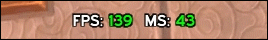
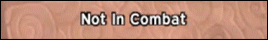
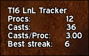
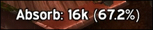
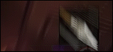

	<h1>MoP WeakAuras (5.4.8)</h1>
	<h4 align="center">
		A collection of custom WeakAuras created while playing Mists of Pandaria.
	</h4>

---

##### [FPS & MS Counter](FPSMS/)

##### [Time In Combat](TimeInCombat/)

##### [Tier 16 Lock and Load Tracker](LnLTracker/)

##### [Total Absorb Amount](TotalAbsorb/)

##### [No Serpent Sting on Boss Warning](NoSerpentStingBoss/)

 

## Installation

Import the encoded string located at `<CHOSEN_WEAKAURA>/.import`

Lua string can be found at `<CHOSEN_WEAKAURA>/.weakaura.lua`